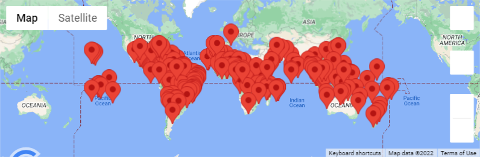
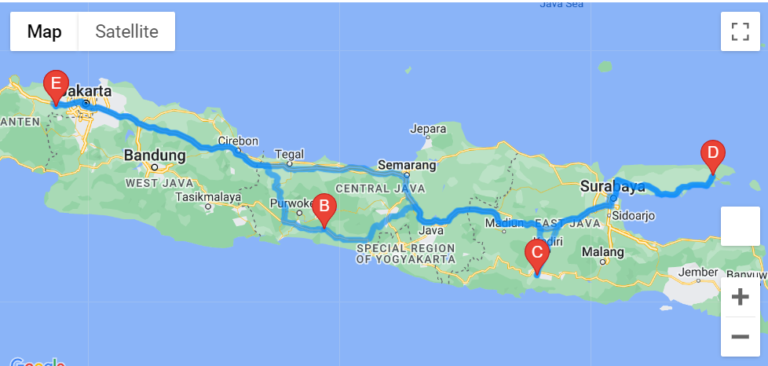

# World_Weather_Analysis

## Overview
My client requested that we produce the backend programming to enhance the PlanMyTrip app. This application will have the ability to filter the data based on weather preferences and give potential locations for travel along with the nearest hotel.

## Results
The program (still in beta phase) produces 2000 random longitude and latitude coordinates. This will then try to find the nearest city based on citipy database of city coordinates. It will also ensure that there is no repeat destinations.

The result of this comes out to approximately 750 potentially viable cities for travelling. This list can be filtered by user input of minimum and maximum temperatures. At the time of development, the temperatures are limited to kelvin, but can be improved upon further in the future with some updates. 

The resulting sample looks as below:
### Fig 1. City Locations Based on Temperature Preferences from 294 - 302 Kelvin

This map shows all the potential cities from 294 kelvin (about 70 degrees fahrenheit) to 302 (about 85 degrees fahrenheit). These are warm temperatures that are perfect for typical travel, but can be expanded or shrunk with user preference.

From there, the user should choose 4 cities that are close by to vacation around. The user should be able to choose 4 cities. The ability to select the 4 cities can be done in the front end user interface and can be saved into the program later. Here is an example of 4 cities within the same country:
### Fig 2. 4 City Locations

As shown in these diagrams, 4 close cities have been selected. The user can then choose to travel by driving, biking, or walking (depending on how close the cities are). The following is the result when choosing to drive starting from Cikupa:
### Fig 3. 4 City Locations by Driving

This shows the path to drive for each stop along the way. The markers are interactive and show the nearest hotel when stopping by the city. 

## Summary
Though in the beta stages, PlanMyTrip app is functional with enough utility to be able to plan a trip based on weather preferences. There can be future updates to allow for other preferences and further narrow the search.